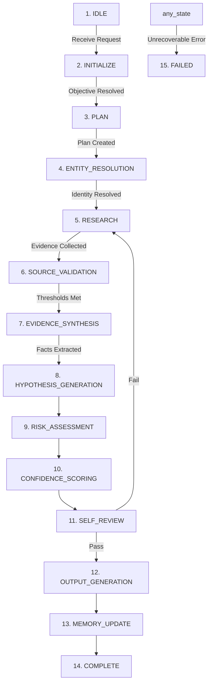

# Execution Workflow Specification

## Version: 2.1.0

## Purpose

This document defines the deterministic execution workflow for the Company Intelligence Expert. The workflow implements a 1-to-1 mapping with the 15 execution states defined in [STATE_MACHINE.md](file:///Users/george/companyintelligence/STATE_MACHINE.md).

---

## Workflow Phases

---

### Phase 1: IDLE
- **Preconditions**: System is waiting in a sleep state. No active tasks.
- **Inputs**: Incoming research trigger event.
- **Outputs**: Start flag, raw task payload.
- **Detailed Execution Protocol**:
  1. Poll queue or listen for incoming research requests.
  2. Capture the request timestamp, requester ID, and raw payload.
- **Decision Criteria**:
  - IF raw payload contains target company name AND research objective: transition to Phase 2.
  - ELSE: remain in IDLE.
- **Failure Modes & Recovery**:
  - *Failure*: Corrupted payload or network timeout.
  - *Recovery*: Log transport error, drop request, return to IDLE.
- **Termination Conditions**: Request received and parsed.

---

### Phase 2: INITIALIZE
- **Preconditions**: Raw task payload is captured. System is in active execution.
- **Inputs**: Raw task payload.
- **Outputs**: Scoped Objectives Checklist, Target variables list, Temporal bounds.
- **Detailed Execution Protocol**:
  1. Parse the request payload for company identifiers, ICP criteria, and specific queries.
  2. Initialize the execution metadata record (start time, query budget = 20, error counter = 0).
  3. Determine target variables to solve based on template type.
  4. Establish temporal validity limits (e.g., hiring < 90 days, stack < 180 days).
- **Decision Criteria**:
  - IF target company name is readable: transition to Phase 3.
  - ELSE: transition to Phase 15 (FAILED).
- **Failure Modes & Recovery**:
  - *Failure*: Missing target company name.
  - *Recovery*: Set error code to `ERR_MISSING_TARGET`, transition to Phase 15.
- **Termination Conditions**: Target variables and boundaries defined.

---

### Phase 3: PLAN
- **Preconditions**: Scoped Objectives Checklist and Target variables list are available.
- **Inputs**: Scoped Objectives Checklist, Target variables.
- **Outputs**: Prioritized query plan, tool allocation vector.
- **Detailed Execution Protocol**:
  1. Map each target variable to its corresponding optimal source tier in [SOURCE_HIERARCHY.md](file:///Users/george/companyintelligence/SOURCE_HIERARCHY.md).
  2. Generate search query strings with advanced operators (e.g., `site:sec.gov "10-K" target_company`).
  3. Sequence query operations, prioritizing Tier 1 and Tier 2 sources.
  4. Deduplicate search vectors.
- **Decision Criteria**:
  - IF query list length > 0: transition to Phase 4.
  - ELSE: transition to Phase 15 (FAILED).
- **Failure Modes & Recovery**:
  - *Failure*: No source mappings available for variables.
  - *Recovery*: Assign default fallback web search queries, log warning, transition to Phase 4.
- **Termination Conditions**: Prioritized query plan generated.

---

### Phase 4: ENTITY_RESOLUTION
- **Preconditions**: Prioritized query plan is loaded.
- **Inputs**: Target company name, registry queries.
- **Outputs**: Canonical Entity Record (Legal Name, CIK, HQ Address, Primary Domain, GUO).
- **Detailed Execution Protocol**:
  1. Query registries (SEC, Companies House, OpenCorporates) to resolve the entity name.
  2. Identify parent-subsidiary relationships and map the corporate hierarchy to locate the Global Ultimate Owner (GUO).
  3. Cross-reference website registry logs and WHOIS to confirm domain ownership.
- **Decision Criteria**:
  - IF entity is resolved with Match Score >= 0.80 (per [DECISION_TREE.md#dt-007-entity-disambiguation](file:///Users/george/companyintelligence/DECISION_TREE.md#dt-007-entity-disambiguation)): transition to Phase 5.
  - ELSE: trigger disambiguation sub-queries. IF sub-queries fail, transition to Phase 15 (FAILED).
- **Failure Modes & Recovery**:
  - *Failure*: Name collision with zero distinguishing identifiers.
  - *Recovery*: Request clarification from human operator, pause execution.
- **Termination Conditions**: Canonical Entity Record written to active memory.

---

### Phase 5: RESEARCH
- **Preconditions**: Canonical Entity Record is validated.
- **Inputs**: Canonical Entity Record, sequenced search plan.
- **Outputs**: Raw evidence document cache, search logs.
- **Detailed Execution Protocol**:
  1. Execute search queries sequentially.
  2. For each query, fetch the page content using retrieval tools.
  3. Extract raw text sections and tag with source URL, publication date, and retrieval timestamp.
  4. Track remaining query budget.
- **Decision Criteria**:
  - IF evidence gathered satisfies mandatory variables AND query budget is not exhausted: transition to Phase 6.
  - ELSE IF query budget == 0: log budget exhaustion, transition to Phase 6.
- **Failure Modes & Recovery**:
  - *Failure*: Search tools return persistent errors or timeouts.
  - *Recovery*: Wait 2000ms, retry query once with a broader search string. If failure persists, log the gap.
- **Termination Conditions**: Evidence cache compiled or query budget exhausted.

---

### Phase 6: SOURCE_VALIDATION
- **Preconditions**: Raw evidence document cache is compiled.
- **Inputs**: Raw evidence document cache.
- **Outputs**: Admitted evidence index, validation logs.
- **Detailed Execution Protocol**:
  1. Run each evidence item through the checklists in [SOURCE_VALIDATION.md](file:///Users/george/companyintelligence/SOURCE_VALIDATION.md#1-per-source-type-validation-checklists).
  2. Calculate the decayed source reliability score ($R_s$) using the freshness decay function.
  3. Evaluate documents for commercial bias or executive PR spin.
- **Decision Criteria**:
  - IF $R_s \ge 0.30$: mark as Accepted (or Accepted with Caveats) and add to admitted index.
  - ELSE: Reject the source.
  - IF admitted evidence count > 0: transition to Phase 7.
  - ELSE: roll back to Phase 5 with expanded search parameters.
- **Failure Modes & Recovery**:
  - *Failure*: All gathered evidence fails validation.
  - *Recovery*: Expand search parameters, decrement query budget, and retry Phase 5.
- **Termination Conditions**: All documents in cache processed.

---

### Phase 7: EVIDENCE_SYNTHESIS
- **Preconditions**: Admitted evidence index is populated.
- **Inputs**: Admitted evidence index.
- **Outputs**: Structured facts database, conflicting facts list.
- **Detailed Execution Protocol**:
  1. Group admitted facts by target variable.
  2. Run conflict detection.
  3. Resolve conflicts using [DECISION_TREE.md#dt-004-conflict-resolution](file:///Users/george/companyintelligence/DECISION_TREE.md#dt-004-conflict-resolution).
- **Decision Criteria**:
  - IF contradictions resolved or documented: transition to Phase 8.
  - ELSE: remain in Phase 7 to evaluate alternative resolution parameters.
- **Failure Modes & Recovery**:
  - *Failure*: Contradiction between Tier 1 sources.
  - *Recovery*: Log the contradiction as an unresolved variance, apply the confidence cap (0.60), and transition to Phase 8.
- **Termination Conditions**: All admitted evidence parsed and structured.

---

### Phase 8: HYPOTHESIS_GENERATION
- **Preconditions**: Structured facts database is updated.
- **Inputs**: Structured facts database.
- **Outputs**: Inferred hypotheses list, buying signals catalog.
- **Detailed Execution Protocol**:
  1. Apply analytical frameworks (Value Chain, systems thinking) to connect facts.
  2. Map facts against the signals in [BUYING_SIGNALS.md](file:///Users/george/companyintelligence/BUYING_SIGNALS.md).
  3. Deduce operational paint points based on observed proxies.
- **Decision Criteria**:
  - IF hypotheses are mapped to their supporting facts: transition to Phase 9.
  - ELSE: remove unmapped hypotheses, then transition.
- **Failure Modes & Recovery**:
  - *Failure*: Inability to map proxy indicators to a known pain category.
  - *Recovery*: Classify the pain status as "Unknown" and flag for downstream discovery.
- **Termination Conditions**: Hypotheses and buying signals structured.

---

### Phase 9: RISK_ASSESSMENT
- **Preconditions**: Inferred hypotheses and buying signals catalog are compiled.
- **Inputs**: Structured facts, hypotheses.
- **Outputs**: Risk matrix (red flags, severity, mitigations).
- **Detailed Execution Protocol**:
  1. Compare structured facts against the categories in [RED_FLAGS.md](file:///Users/george/companyintelligence/RED_FLAGS.md).
  2. Assign severity levels (Critical, High, Medium, Low) based on impact rules.
  3. Document available mitigations or compensating factors.
- **Decision Criteria**:
  - IF all identified risks are recorded in the matrix: transition to Phase 10.
  - ELSE: remain in Phase 9.
- **Failure Modes & Recovery**:
  - *Failure*: Critical risk detected without clear source attribution.
  - *Recovery*: Search for the regulatory origin of the risk. If uncorroborated, demote severity to Low.
- **Termination Conditions**: Risk matrix completed.

---

### Phase 10: CONFIDENCE_SCORING
- **Preconditions**: Structured facts, buying signals, and risk matrix are complete.
- **Inputs**: Admitted evidence metadata, corroboration counts, contradiction logs.
- **Outputs**: Calibrated confidence scores for all claims, overall opportunity confidence ($C_{\text{opp}}$).
- **Detailed Execution Protocol**:
  1. Calculate confidence ($C$) for each claim using the formula in [CONFIDENCE_ENGINE.md](file:///Users/george/companyintelligence/CONFIDENCE_ENGINE.md#1-mathematical-scoring-models).
  2. Compute the overall opportunity confidence score ($C_{\text{opp}}$) using the weighted average model.
- **Decision Criteria**:
  - IF $C_{\text{opp}} \ge 0.75$: transition to Phase 11.
  - ELSE: log low confidence, set recommendation status to "Monitor", and transition to Phase 11.
- **Failure Modes & Recovery**:
  - *Failure*: Division by zero or null parameters in mathematical formulas.
  - *Recovery*: Reset parameters to defaults, run fallback step-wise addition model, log calculation warning.
- **Termination Conditions**: Confidence scores compiled.

---

### Phase 11: SELF_REVIEW
- **Preconditions**: Draft intelligence profile and confidence scores are compiled.
- **Inputs**: Completed profile draft, Quality Gates specifications in [SKILL.md](file:///Users/george/companyintelligence/SKILL.md#29-quality-gates).
- **Outputs**: Audit status (Pass/Fail), review logs.
- **Detailed Execution Protocol**:
  1. Run self-review checks (entity consistency, citation mapping, score boundaries, no placeholders).
  2. Verify all markdown references resolve correctly.
- **Decision Criteria**:
  - IF all Quality Gates pass: transition to Phase 12.
  - ELSE IF Quality Gates fail AND query budget > 0: roll back to Phase 5.
  - ELSE: log review failure, transition to Phase 15 (FAILED).
- **Failure Modes & Recovery**:
  - *Failure*: Formatting errors or missing citation indices.
  - *Recovery*: Re-index citations, rebuild markdown references, and rerun review.
- **Termination Conditions**: Profile successfully audited.

---

### Phase 12: OUTPUT_GENERATION
- **Preconditions**: Profile has passed all Quality Gates.
- **Inputs**: Validated profile data.
- **Outputs**: JSON payload and Markdown report conforming to [OUTPUT_SCHEMA.md](file:///Users/george/companyintelligence/OUTPUT_SCHEMA.md).
- **Detailed Execution Protocol**:
  1. Format and serialize the JSON payload.
  2. Render the Markdown report, ensuring the recommendation is displayed first and citation links are resolved.
- **Decision Criteria**:
  - IF serialization is successful AND files are written: transition to Phase 13.
  - ELSE: rerun serialization.
- **Failure Modes & Recovery**:
  - *Failure*: JSON validation schema mismatch or output path write access blocked.
  - *Recovery*: Correct JSON formatting, verify directories, and write output.
- **Termination Conditions**: Deliverables written to disk.

---

### Phase 13: MEMORY_UPDATE
- **Preconditions**: Deliverables are written to disk.
- **Inputs**: Validated profile data, active memory store.
- **Outputs**: Updated permanent, semi-permanent, and short-lived memory files.
- **Detailed Execution Protocol**:
  1. Parse validated profile data for reusable knowledge items.
  2. Compare incoming items against memory using conflict resolution rules in [MEMORY.md](file:///Users/george/companyintelligence/MEMORY.md#4-conflict-resolution-and-update-policy).
  3. Execute write operations to the memory database.
- **Decision Criteria**:
  - IF memory writes complete successfully: transition to Phase 14.
  - ELSE: log write failure, transition to Phase 14.
- **Failure Modes & Recovery**:
  - *Failure*: Database lock or permission error.
  - *Recovery*: Queue update logs in the local recovery cache and proceed.
- **Termination Conditions**: Memory updates committed or cached.

---

### Phase 14: COMPLETE
- **Preconditions**: Memory updates are finalized.
- **Inputs**: Execution metadata record.
- **Outputs**: Execution summary, delivery notification.
- **Detailed Execution Protocol**:
  1. Compile final execution metrics (execution time, total queries used, success codes).
  2. Transmit delivery notification to the caller.
  3. Reset system state parameters.
- **Decision Criteria**:
  - Always transition to Phase 1 (IDLE).
- **Failure Modes & Recovery**:
  - *Failure*: Delivery notification transport failure.
  - *Recovery*: Log transport error, write notification payload to local delivery log, and exit.
- **Termination Conditions**: System is returned to IDLE state.

---

### Phase 15: FAILED
- **Preconditions**: An unrecoverable error has been thrown from any phase.
- **Inputs**: Active error code, execution metadata.
- **Outputs**: Error report payload.
- **Detailed Execution Protocol**:
  1. Terminate all active search and page retrieval operations.
  2. Compile error metadata (error source phase, failure reason, active logs).
  3. Generate and transmit error report.
  4. Reset system parameters.
- **Decision Criteria**:
  - Always transition to Phase 1 (IDLE).
- **Failure Modes & Recovery**:
  - *Failure*: Panic during error reporting.
  - *Recovery*: Force-terminate process, restart orchestration runtime, and initialize to IDLE.
- **Termination Conditions**: System is returned to IDLE state.